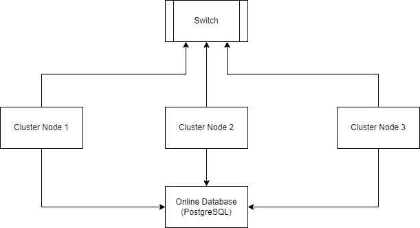
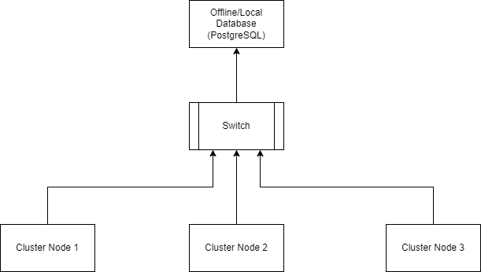

 Linux Cluster Monitoring Agent

# Introduction

When using a cluster of machines, it is important to be able to monitor your resources adequately. The primary stakeholders for this type of agent would be system administrators or developers hosting cloud-based software. This agent uses Bash to fetch all data from the system and save it to a database and Docker to host a PostgreSQL server as a container.

# Quick Start

- The first step is to generate your psql container. This is done using `bash psql_docker.sh create {db_username} {db_password}`.
- Start your psql container using `bash psql_docker.sh start`
- Create your table ddl using `psql -h {host} -U {db_username} -d host_agent -f sql/ddl.sql`
- Insert your hardware specification using `bash host_info.sh {hostname} 5432 host_agent {db_username} {db_password}`
bash scripts/host_usage.sh localhost 5432 host_agent postgres password
- *[Optional]* Insert your first hardware usage data using `bash host_usage.sh {hostname} 5432 host_agent {db_username} {db_password}`
- Find the absolute path to your `/linux_sql/scripts/` folder. This can be done by navigating to the folder with a terminal and using the `pwd` command to see the path
- Using the absolute path `{path}` from the previous step, setup a crontab to check resources every minute. This can be done by using the `crontab -e` command to open the crontab environment editor. Once the environment editor is opened, you can setup a crontab instruction by inserting the following statement in the environment editor `* * * * * bash {path}/host_usage.sh {host} 5432 host_agent {db_username} {db_password} > /tmp/host_usage.log`

# Implementation

## Architecture

There are two proposed architectures to use this software.

### Architecture 1: Online Database

This architecture requires your database to be a publically hosted database. The advantages offered are that the data can be pulled from other locations, and pushed from different switch clusters. Because the database is independent from the cluster network, the agent will continue running even if the switch network fails.

### Architecture 2: Offline Database

This architecture uses a locally hosted or offline database. In this configuration, the database must be setup such that all the cluster nodes have access to its host and port. This can be done by configuring a machine on the switch network to serve as the host of the database and make sure it only accepts connections from other machines on the same switch network. The host machine could also be a cluster node.

**IMPORTANT:** All cluster nodes must run on Linux for the scripts to run properly. The following packages must be installed on the machine: `docker postgresql`

## Scripts

- psql_docker.sh: 
    - `bash psql_docker.sh (start|stop)` starts or stops the psql server
    - `bash psql_docker.sh (create) {db_username} {db_password}` creates a psql server and gives access to username={db_username} with password {db_password}.
- host_info.sh:
    - `bash host_info.sh {hostname} 5432 host_agent {db_username} {db_password}` will add the current machine's hardware specifications to the database. This **must** before using the `host_usage.sh` script, otherwise it will not be able to track the current machine. 
- host_usage.sh:
    - `bash host_usage.sh {hostname} 5432 host_agent {db_username} {db_password}` will add the resource usage information of the current machine to the database
- crontab:
    - `crontab -e` will open the environment a UNIX text editor (likely vim)
    - `* * * * * bash {path}/host_usage.sh {host} 5432 host_agent {db_username} {db_password} > /tmp/host_usage.log` is the crontab instruction that must be added to the environment so that the resources are tracked every minute. If you wish to customize the instruction, refer to the [crontab manual](https://man7.org/linux/man-pages/man5/crontab.5.html)

## Database Modeling

### Host Info table DDL

| id      | hostname | cpu_number | cpu_architecture | cpu_model | cpu_mhz | l2_cache | timestamp | total_mem |
|---------|----------|------------|------------------|-----------|---------|----------|-----------|-----------|
| SERIAL  | VARCHAR  | INT2       | VARCHAR          | VARCHAR   | FLOAT8  | INT4     | TIMESTAMP | INT4      |

### Host Usage table DDL

| timestamp | host_id | memory_free | cpu_idle | cpu_kernel | disk_io | disk_available |
|-----------|---------|-------------|----------|------------|---------|----------------|
| TIMESTAMP | SERIAL  | INT4        | INT2     | INT2       | INT4    | INT4           |

# Test

This was tested using `echo` statements to check each variable individually. After I was convinced I had all the right values for the variables, I used an `echo` statement to see the `INSERT` statement before it was ran by the script, and ran the statement manually to make sure it works. Finally, I made sure the PG_PASSWORD environment variable was set properly and then I was ready to use the script

# Deployment

The application can be pulled from GitHub for use. I also wrote a small setup script `setup.sh` to quickly setup the work environment. The correct usage is `bash setup.sh [-d directory_name]`. If the `-d` parameter isn't used, then the software will be setup a default `cluster_management` directory. 

# Improvements:
- Make a setup script
- User cannot decide port nor hostname when creating the psql container
- For host_info.sh and host_usage.sh, the port and database name are constants (5432 and host_agent respectively) and could be left out of the arguments
- Use `awk` only once to extract all valid the arugments we need for inserting data